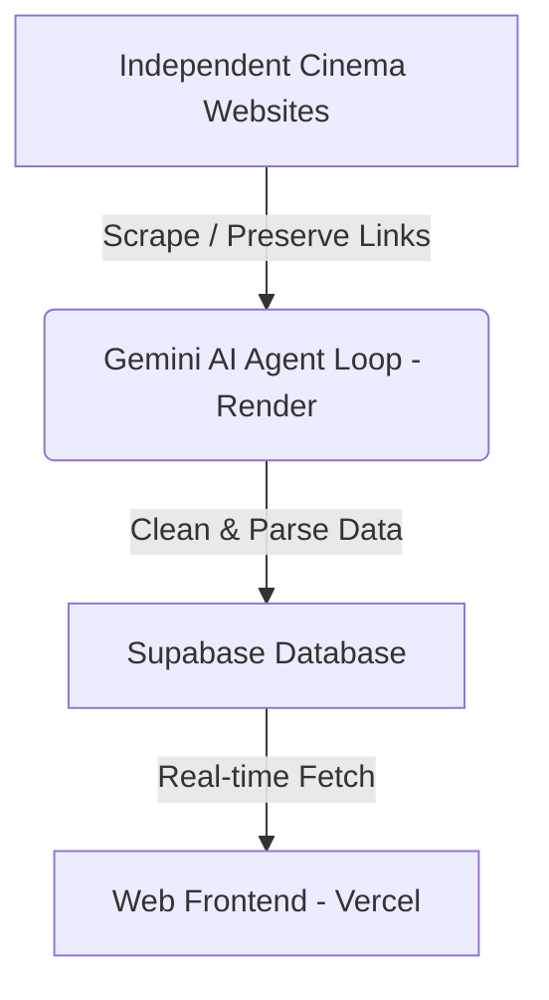

# CinemAgent: Tel Aviv Independent Cinema Guide

CinemAgent is an agentic scraper and directory designed to aggregate, clean, and display movie screenings from independent, fringe, and artsy theaters across Tel Aviv (starting with Jaffa Cinema).

The project uses an AI agent (Gemini 2.5) that scrapes websites dynamically, corrects formatting, parses release metadata and ticket checkout links, deduplicates listings, and persists them to a database.

---

## Architecture Overview



1. **Agent Loop (Worker on Render)**: 
   A Python-based worker running on a schedule (Cron job) on **Render**. It runs `src/run.py` which triggers a Gemini-powered agent loop. The agent executes tools to:
   - Scrape cinema pages (with link preservation).
   - Clean up punctuation, Hebrew/English formatting errors (e.g., correcting `!Mamma Mia` to `Mamma Mia!`), and strip subtitle annotations (e.g., `- HEB SUBS`).
   - Extract the release year and direct ticket checkout URL.
   - Bulk-insert/overwrite listings into the database.
2. **Database (Supabase)**:
   Acts as the central storage. Holds a `screenings` table. When the scraper runs, it clears the current listings for the theater and performs a bulk insert.
3. **Web Frontend (Vercel)**:
   A lightweight, premium, single-page web app hosted on **Vercel** (`src/index.html`). It connects directly to Supabase client-side using the public anonymous key to query and display the screenings, sorted by earliest date/time.

---

## Database Setup

Run the following SQL script in your **Supabase SQL Editor** to create the target table:

```sql
create table screenings (
  id bigint generated by default as identity primary key,
  title text not null,
  date text not null,
  time text not null,
  cinema text,
  year text,
  ticket_url text,
  imdb_url text,
  imdb_score text,
  rt_score text,
  poster_url text,
  plot text,
  created_at timestamp with time zone default timezone('utc'::text, now()) not null
);
```

---

## Local Setup

### 1. Requirements & Interpreter
Ensure you have **Python 3.11+** installed.

### 2. Install Dependencies
Set up your virtual environment and install the required packages:
```bash
# Activate your venv
.venv\Scripts\activate

# Install requirements
pip install -r requirements.txt
```

### 3. Environment Variables
Create a `.env` file at the root of the project with your secrets:
```env
GEMINI_API_KEY=your_gemini_api_key
SUPABASE_PROJECT_URL=https://your-project-id.supabase.co
SUPABASE_KEY=your-supabase-service-role-or-anon-key
```

### 4. Run the Scraper
To manually run the scraper agent loop:
```bash
python src/run.py
```

### 5. Run the Website Locally
To spin up a simple local server to preview the site:
```bash
python -m http.server 8000
```
Then navigate to: `http://localhost:8000/src/index.html`

---

## Deployment

* **Frontend**: Push the repository to GitHub, link it to **Vercel**, and configure Vercel to serve `src` as the root directory or configure it to deploy `src/index.html`.
* **Agent Loop**: Deploy the Python worker script to **Render** as a Cron Job, configure it to run `python src/run.py` on your preferred schedule (e.g. daily), and set your `.env` variables in Render's dashboard environment settings.
