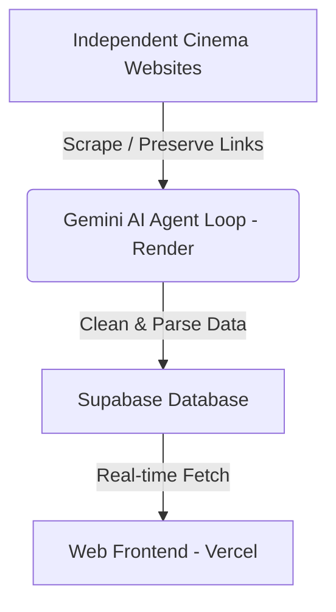

# CinemAgent: Tel Aviv Independent Cinema Guide

CinemAgent is an agentic scraper and directory designed to aggregate, clean, and display movie screenings from independent, fringe, and artsy theaters across Tel Aviv (starting with Jaffa Cinema).

The project uses an AI agent (Gemini 2.5) that scrapes websites dynamically, corrects formatting, parses release metadata and ticket checkout links, deduplicates listings, and persists them to a database.

---

## Architecture Overview

```mermaid
graph TD
    A[Independent Cinema Websites] -->|Scrape / Preserve Links| B(Gemini AI Agent Loop - Render)
    B -->|Clean & Parse Data| C[Supabase Database]
    C -->|Real-time Fetch| D[Web Frontend - Vercel]
```

1. **Agent Loop (Worker on Render)**: 
   A Python-based worker running on a schedule (Cron job) on **Render**. It runs `src/run.py` which triggers a Gemini-powered agent loop. The agent executes tools to:
   - Scrape cinema pages (with link preservation).
   - Clean up punctuation, Hebrew/English formatting errors (e.g., correcting `!Mamma Mia` to `Mamma Mia!`), and strip subtitle annotations (e.g., `- HEB SUBS`).
   - Extract the release year and direct ticket checkout URL.
   - Bulk-insert/overwrite listings into the database.
2. **Database (Supabase)**:
   Acts as the central storage. Holds a `screenings` table. When the scraper runs, it clears the current listings for the theater and performs a bulk insert.
3. **Web Frontend (Vercel)**:
   A lightweight, premium, single-page web app hosted on **Vercel** (`src/index.html`). It connects directly to Supabase client-side using the public anonymous key to query and display the screenings, sorted by earliest date/time.

